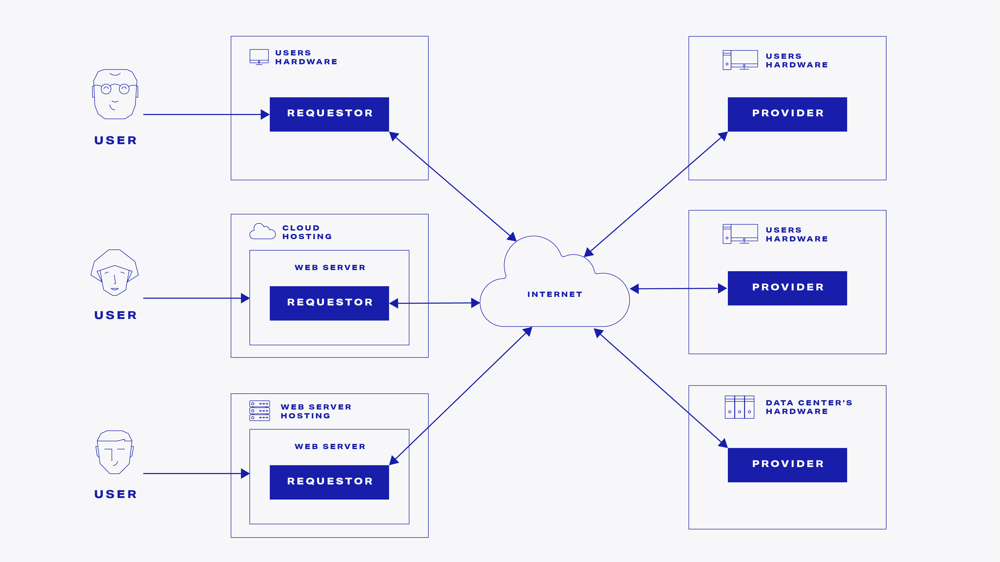

# The Golem SDK documentation

## What is Golem?


Golem is a global, open source, decentralized supercomputer that anyone can use. It is made up of the combined computing power of the users' machines, from PCs to entire data centers.


Under the hood, Golem is a decentralized marketplace where IT resources such as computation hardware are bought and sold. The actors in this decentralized network can assume one of the two nonexclusive profiles:

* **Requestor**

Has a need to use IT resources such as computation hardware. Those resources are purchased in the decentralized market. The actual usage of the resources is backed by Golem's decentralized infrastructure.  

* **Provider**

Has free IT resources that can be shared with other actors in the network. Those resources are sold in the decentralized market.

Both requestors and providers may be launched on different types of hardware. Those can be laptops, desktop computers, servers, and cloud environments. In case of requestors, it is also feasible for them to be executed on mobile devices.

## How can I benefit?

There are two ways you can benefit from Golem:

### **Develop a Golem-based product**

Our decentralized stacks form a unique business value proposition your product can be based on. 


Ensuring that the development of products based on Golem is smooth and effortless is our core business.


 Plus, there are no licensing fees. The details are described here:



### **Become a Golem provider**

If you have Internet-connected device running Linux, you can install a Golem Network provider package, share your hardware resources, and **have a passive income stream straight to your** [**ethereum**](https://ethereum.org/) **address**. Just follow this link:



## Golem is free and open source


Golem is open-source software. All the code is available under the GPL license.

[https://github.com/golemfactory/yagna](https://github.com/golemfactory/yagna)


## Documentation

This is Golem SDK documentation. These documentation resources are aimed at developers working on products based on Golem.

The documentation aimed at developers working on developing Golem infrastructure codebase itself is here:

[https://golem-network.gitbook.io/golem-internal-documentation-test/](https://golem-network.gitbook.io/golem-internal-documentation-test/)

