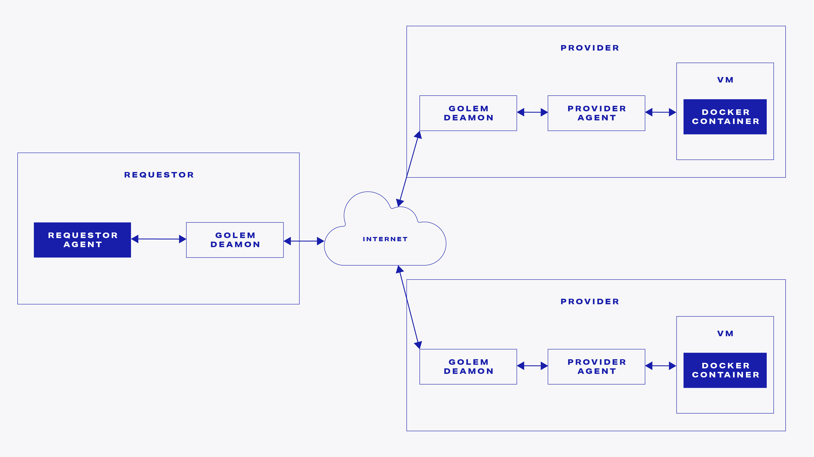

# Golem's details


This documentation section is under development.


## Golem daemon and the agents

The Golem is defined mainly by the Golem network protocol.


Golem daemon is the default implementation of the Golem network protocol.


The same Golem daemon binary is used both by the requestor and provider.


The difference between requestor and provider is the use of requestor or provider agent.


As the role of the provider is to serve IT resources, the actual provider agent logic is universal to all business cases. This is why we provide provider binaries as a pre-built Linux installation package.

When building a product on Golem, there are two areas that require custom development \(marked with dark blue background on the diagram above\):

* **Requestor agent**

Defines the resource demands and orchestrates the task execution

* **Docker image**

Defines the actual code that performs the tasks on the provider's hardware

## Being requestor and provider at the same time


Golem daemon can act as requestor and provider at the same time.


Although the Golem code base allows Golem demon to act as a requestor and provider at the same time, we currently do not support this scenario configuration by any dedicated tutorials.

