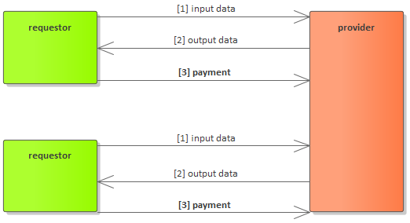

# Provider

## What is a provider?

Technically speaking provider is some code running on Internet-connected hardware. The code implements the Golem network protocol, thus the code acts as an actor in the Golem. 

The characteristic that describes the provider agent is the fact of sharing hardware resources to the Golem. In practice, almost any computer might act as provider hardware. It can be a laptop, desktop, or a server machine. The particular resource details \(for example number of CPUs or memory limit\) that are subject to sharing can be configured by the hardware owner.


We provide provider binaries as a pre-build Linux installation package. You do not need to perform any development or extensive configuration to have Golem provider up and running on your Linux machine.


## What does a provider do?

1. The provider announces the availability of its resources in the decentralized market. This announcement is called an offer.
2. The decentralized market does the matching between provider side offers and requestor side demands.
3. If there is a requestor willing to use the provider's resources, the transaction is arranged.
4. The resources are used by the requestor \(for example by transferring input/output files and running a particular docker container on the provider's hardware\).
5. The provider bills the requestor.
6. The requestor performs [ethereum](https://ethereum.org/) payment for resource usage.

## How can I benefit from running the provider on mine hardware?

After installing and running the Golem provider you will benefit in the following way:

* serving other actors in the Golem that are in need of IT resources with your hardware that is currently not in use
* receiving payments for the resources your share


The payments are done through [ethereum](https://ethereum.org/), so the whole process is very simple!


The typical resources usage scenario is as follows: after receiving input data, the processing is done by your hardware, output data being sent back to the requestor, the [ethereum](https://ethereum.org/) payment is done. 

It is that simple.

## How I can become a Golem provider?

Becoming a Golem network provider is open to anyone. The installation and configuration are super easy. The details are described in the:



