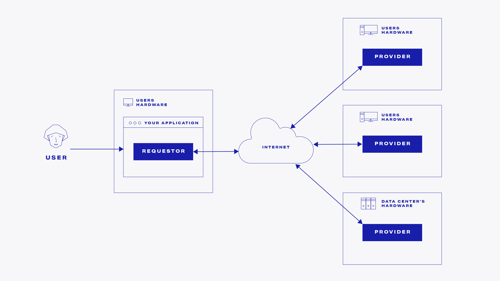
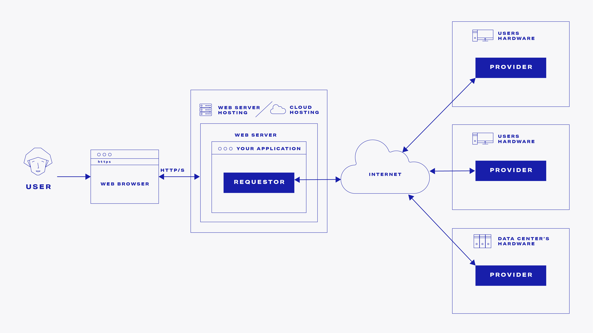
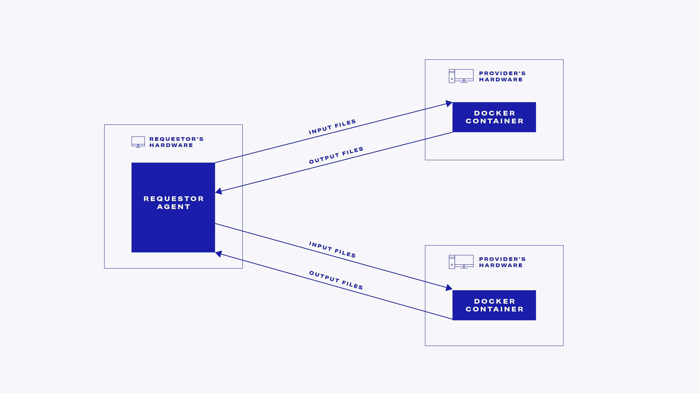

# Requestor

## What is a requestor?

Technically speaking, Golem requestor is a specific piece of code running on an Internet-connected device.

The characteristic that describes the requestor agent is the need to use hardware resources that are available in the Golem network, shared by its providers. 


Because local hardware resources on your desktop, mobile device, or even server machine are always limited, there is always some task that local, requestor's hardware can not perform in a reasonable time frame or not at all \(for example because of memory limit\).

There are no set limits on the resources available in Golem. Requestors can use as much of resources as they need. All of those hardware resources can be used at the same time thus reducing hour- or days-long computations to seconds.


## What does a requestor do?

The typical use case for the requestor is as follows:

* **Define the need**

Define the IT resources it needs. Those needs \(for example CPU and memory requirements\) are then published in a form of a Demand in Golem's decentralized market.

* **Buy the resources**

If the decentralized market already contains offers previously announced by the providers that match the requirements of the particular requestor's demand, the resources thereby offered are purchased to be used by the requestor.

* **Use the resources**

The actual usage depends on the nature of the resources. For now, the most common scenario is performing computations, but Golem is not limited to this use case.

* **Pay for the resources usage**

The last step is to pay for the usage of the resources \(unless the provider is offering them for free :\). There are many possible payment scenarios, but [Ethereum](https://ethereum.org/)-based payment is the default one.

## How requestors are made and used?

As requestors are based on some specific business need there is no single requestor agent that fits all the use cases.


We do not provide any predefined requestor binary, as it is up to third parties to develop products that are based on Golem's unique value proposition. 


There are many possible scenarios defining the actual form and shape of a product that is based on Golem.

### Requestor running on the user's device

The simplest scenario is when the requestor binary is running on a device that the end-user has physical access to, e.g.:

* a mobile device \(phone/tablet\)
* a laptop
* a desktop box

In this scenario, your product front-end layer and the requestor can be integrated into one binary package.

### Webserver-based requestor

In this scenario, it doesn't matter what the end user's local device is, as long as it can run a web browser.

Here, your application code is running inside a web server and the front-end layer is accessed through a browser.


To write a fully functional requestor you need to write just a few lines of code. 

The rest is done by Golem's infrastructure.


The basic requestor development tutorial is here:



## How can I benefit from being a requestor?

The typical benefit for the requestor is to have instant access to a very large pool of hardware. Instead of using local hardware, the requestor is able to use IT resources available on the decentralized market. 


Remember that one requestor can use hardware from many providers at the same time. 


Think about training a large ML model in seconds instead of hours. This is just an example, as there are many interesting business use cases described in the:

## How does a Requestor work?

For the basic computations scenario the details of the resource usage are as follows:

* Specify what docker image to use:
  * existing one, for example from the [docker hub](https://hub.docker.com/)
  * create a custom docker image
* For each of the providers whose resources a requestor wishes to utilize, \(there is no set limit on the number\) define the files containing the input data for the computations.
* For each of the docker containers created on the provider's hardware:
  * transfer the input files to a volume available within the docker container.
  * execute the "run task" command \(actual command string is defined in the requestor agent code\)
  * transfer the output files from the docker container's volume to the requestor.

