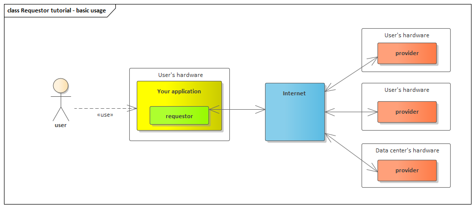

# Requestor

## What is a requestor?

Technically speaking the Golem requestor is some code running on Internet-connected hardware.

The characteristic that describes the requestor agent is the need to use hardware resources that are available in the Golem being shared by providers. 


Because local hardware resources on your desktop, mobile device, or even server machine are always limited, there is always some task that local, requestor's hardware can not perform in a reasonable time frame or not at all \(for example because of memory limit\).

There is no limit on the resources available in Golem. Requestor can use as many resources as he needs.  All of those hardware resources can be used at the same time thus reducing hour or days-long computations to seconds.


## What does a requestor do?

The typical use case for the requestor is as follows:

* **Define the need**

Define the IT resources it needs. Those needs \(for example CPU and memory requirements\) would be than by the golem infrastructure published in the decentralized market in a form of so-called Demand. 

* **Buy the resources**

If in the decentralized market there are provider announced offers that match requirements of the requestor demand, the resources offered by the provider are both to be used by the requestor.

* **Use the resources**

The actual usage depends on the resources. For now, the most common scenario is performing computations, but the Golem is not limited to this use case.

* **Pay for the resources usage**

The last step is to pay for the usage of the resources \(unless the provider is offering them for free :\). There are many possible payment scenarios, but [Ethereum](https://ethereum.org/) based payment is the default one.

## How requestors are made and used?

As requestors are based on some concrete business need there is no single requestor that fits all the use cases.


We do not provide any predefined requestor binary, as it is up to 3rd parties to develop products that are based on Golem's unique value proposition. 


There are many possible scenarios defining the actual form and shape of the product that is based on Golem.

### User's device based requestor

### Web server based requestor

## How can I benefit from being a requestor?

The typical benefit for the requestor is being able to have instant access to a very large pool of computational hardware.  Instead of using local hardware, the requestor is able to use IT resources available on the decentralized market. 


Remember that one requestor can use hardware from many providers at the same time. 


Think about training a large ML model in seconds instead of hours. This is just an example, as there are many interesting business use cases described in the:



## How does a Requestor work?

For the basic computations scenario the details of the resource usage are as follows:

* Specify what docker image to use/create a custom docker image.
* For each of the used providers \(there is no limit here on the number :\) define the files containing the input data for the computations.
* For each of the docker containers being created on the provider's hardware:
  * Input files are transferred to the docker container file system.
  * Execution of the "run task" command.
  * Output files are transferred from the docker container file system to the requestor.

