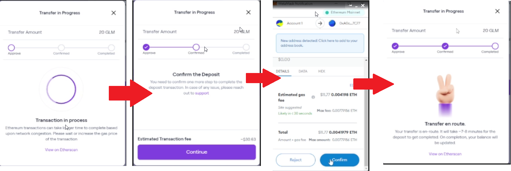
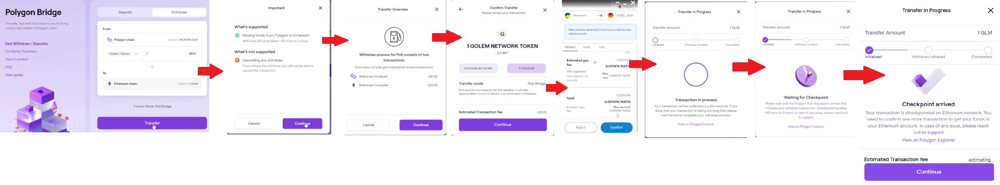
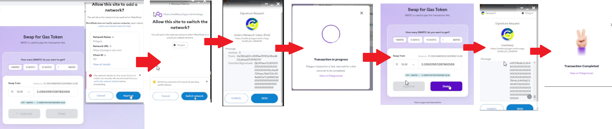

# GLM / Polygon Conversion

## GLM to Polygon

**Prerequisites:**

* Configure metamask wallet extension for chrome / firefox / opera and add your wallet

\
**Go to** [**Polygon Website**](https://wallet.polygon.technology/login?next=%2Fbridge) **(Polygon Bridge)**&#x20;

1\. Choose prefered wallet (This manual will use Metamask as example)

2\. Add permission for metamask wallet (Press SIGN > top right corner)

3\. Choose GLM token and follow instructions (See image below)

**NOTE** : The transaction fee is most time over estimated in our example at the end total cost = \~6$

**(Use Deposit Tab)**

.png>)

4\. Go thru confrimation process&#x20;

5\. Wait until process is finished (takes around 7-8 minutes) > you can click "View on Etherscan" to see the status of the transaction

## Polygon to GLM

**Go to** [**Polygon Website**](https://wallet.polygon.technology/login?next=%2Fbridge) **(Polygon Bridge)**&#x20;

**(Use Withdraw Tab)**&#x20;

**NOTE** : Screenshoot is missing last step because of high gas fee (60$), just press confirm and sign transaction in your metamask wallet and it's done.

## Obtaining Matic tokens

1. Go to Swap for gas token > [https://wallet.polygon.technology/gas-swap](https://wallet.polygon.technology/gas-swap)
2. Choose amount (Minimum = 1 Matic) and follow instructions (See image below)

3\. You can check how much matic you have using "Assets on Polygon" tab.png>)

