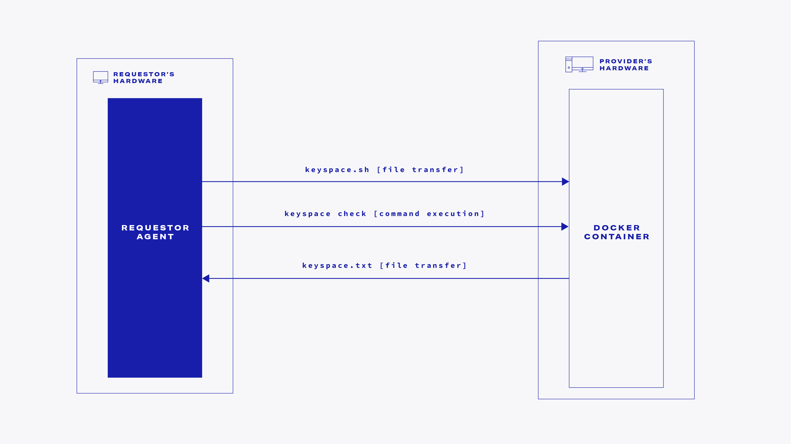

# Tutorial steps

This section contains steps you need to execute in order to run our hashcat password-recovery example. As this tutorial is designed to inspire you to create your own Golem applications, we will explain all the needed details of Golem application implementation.

## Before we begin

In order to develop applications for the Golem network, you need to install yagna daemon on your machine. We're going to assume you're already familiar with the setup of the environment required to run Python high-level API examples. If you're not, please make sure you proceed through our quick primer to get up to speed:



Once you're done with the tutorial above, make sure you're again in yapapi's main directory and move to:

```text
cd examples/yacat
```


So now, we're going to assume that:

* The `yagna` deamon is running in the background. 
* The `YAGNA_APPKEY` environment variable is set to the value of the generated app key.
* The payment is initialized with `yagna payment init -sender`  \(please keep in mind that it needs initialization after each launch of `yagna service run`\).
* The virtual python environment for our tutorial is activated.
* Dependencies are installed and the `yapapi` repository \(containing the tutorial examples\) is cloned.
* In your current directory \(`examples/yacat`\) there are two files that will be used and discussed in this example:
  * `yacat.Dockerfile` - the Docker file used for the definition of the provider's container images
  * `yacat.py` - requestor agent's entry point which deals with orchestration of the container runs.


## Let's get to work - the Dockerfile

Let's start with the Dockerfile \(`yacat.Dockerfile`\). Do we always need a dedicated Dockerfile for our own Golem application?


Golem is designed to use existing Docker images, so you can use any existing docker image. There are no Golem-specific conditions that need to be met by the image.


If there is \(for example on the [docker hub](https://hub.docker.com/)\) no docker image that you need, you will have to create a custom one.

For the yacat example we're going to use the following Dockerfile \(`yacat.Dockerfile`\):

```text
FROM golemfactory/base:1.5

MAINTAINER Radek Tereszczuk <radoslaw.tereszczuk@golem.network>

RUN apt-get update && apt-get install -y alien clinfo

# Install Intel OpenCL driver
ENV INTEL_OPENCL_URL=http://registrationcenter-download.intel.com/akdlm/irc_nas/9019/opencl_runtime_16.1.1_x64_ubuntu_6.4.0.25.tgz

RUN mkdir -p /tmp/opencl-driver-intel
WORKDIR /tmp/opencl-driver-intel
RUN curl -O $INTEL_OPENCL_URL; \
    tar -xzf $(basename $INTEL_OPENCL_URL); \
    for i in $(basename $INTEL_OPENCL_URL .tgz)/rpm/*.rpm; do alien --to-deb $i; done; \
    dpkg -i *.deb; \
    mkdir -p /etc/OpenCL/vendors; \
    echo /opt/intel/*/lib64/libintelocl.so > /etc/OpenCL/vendors/intel.icd; \
    rm -rf *

ENV HASHCAT_VERSION        hashcat-5.1.0
ENV HASHCAT_UTILS_VERSION  1.9

# Update & install packages for installing hashcat
RUN apt-get update && \
    apt-get install -y wget p7zip make build-essential git libcurl4-openssl-dev libssl-dev zlib1g-dev

RUN mkdir /golem/yacat

WORKDIR /golem/yacat
RUN wget --no-check-certificate https://hashcat.net/files/${HASHCAT_VERSION}.7z && \
    7zr x ${HASHCAT_VERSION}.7z && \
    rm ${HASHCAT_VERSION}.7z

RUN wget --no-check-certificate https://github.com/hashcat/hashcat-utils/releases/download/v${HASHCAT_UTILS_VERSION}/hashcat-utils-${HASHCAT_UTILS_VERSION}.7z && \
    7zr x hashcat-utils-${HASHCAT_UTILS_VERSION}.7z && \
    rm hashcat-utils-${HASHCAT_UTILS_VERSION}.7z

#Add link for binary
RUN ln -s /golem/yacat/${HASHCAT_VERSION}/hashcat64.bin /usr/bin/hashcat
RUN ln -s /golem/yacat/hashcat-utils-${HASHCAT_UTILS_VERSION}/bin/cap2hccapx.bin /usr/bin/cap2hccapx

RUN cp /golem/yacat/${HASHCAT_VERSION}/hashcat.hcstat2 /golem/yacat
RUN chmod -R 777 /golem/yacat

RUN apt clean

WORKDIR /golem/work

VOLUME /golem/work /golem/output /golem/resource
```

As Golem does not need any specific elements in the Dockerfile,`yacat.Dockerfile`is just a standard Dockerfile.

### VOLUME: the input/output

The one thing we need to remember while preparing the Dockerfile is to define a place \(or places\) in the container file system that will be used for the file transfer. We are going to use input \(from requestor to the provider\) and output \(from provider to the requestor\) file transfers here.

The volume is defined in the last line of the above Dockerfile:

```text
VOLUME /golem/work /golem/output /golem/resource
```

This makes `/golem/work` a location we will use for our input/output file transfer. For the requestor agent code, which we are going to discuss in the next chapter, we need to know the volume \(or volumes\) name\(s\) and use it as a directory for the file transfers.



On the provider side, all the content of the VOLUME directories is stored in the provider's os file system. 

All the changes in other \(non VOLUME mounted\) container directories content are kept in RAM. The rest of the VM image file system \(not changed, non VOLUME mounted\) content is stored as VM image in the provider's os file system.



Please mind that tasks within a single worker instance - so effectively part of the same activity on a given provider node - run within the same virtual machine and share the contents of a VOLUME between each other.  
  
That means that as long as the execution takes place on the same provider, and thus, on the same filesystem, files in the VOLUME left over from one task execution will be present in a subsequent run.



If your provider side code creates large temporary files, you should store them in the directory defined as VOLUME. Otherwise, the large files will be stored in RAM. RAM usually has a capacity limit much lower than disk space.


### Build process

Now we may proceed with a regular Docker build, using `yacat.Dockerfile`:

```python
docker build . -f yacat.Dockerfile -t yacat
```

As Golem cannot currently use raw docker images and uses its own, optimized `gvmkit` image format, we have to convert our Docker image the following way:

```python
pip install gvmkit-build
gvmkit-build yacat
gvmkit-build yacat --push
```

The important fact is that the last of the above commands, will provide us with a `gvmkit` image hash, that looks like this:

```python
2c17589f1651baff9b82aa431850e296455777be265c2c5446c902e9
```


This hash will identify our image when our Golem application is run. Please copy and save it somewhere as in the requestor agent code, we will need to pass it to the `Engine` in order to have providers use the correct image for the container instances.


The details of docker image conversion are described here:



## The requestor agent code

Let's look at the core of our hashcat example - the requestor agent. Please check the `yacat.py` file below.


The critical fragments of `yacat.py` will be described in the following sections of the tutorial so now, you can just do a quick scan over the big code block below.


```python
#!/usr/bin/env python3
import asyncio
from datetime import datetime, timedelta
import pathlib
import sys

from yapapi import Executor, NoPaymentAccountError, Task, WorkContext, windows_event_loop_fix
from yapapi.log import enable_default_logger, log_summary, log_event_repr  # noqa
from yapapi.package import vm

examples_dir = pathlib.Path(__file__).resolve().parent.parent
sys.path.append(str(examples_dir))

from utils import (
    build_parser,
    TEXT_COLOR_CYAN,
    TEXT_COLOR_DEFAULT,
    TEXT_COLOR_GREEN,
    TEXT_COLOR_RED,
    TEXT_COLOR_YELLOW,
)


def write_hash(hash):
    with open("in.hash", "w") as f:
        f.write(hash)


def write_keyspace_check_script(mask):
    with open("keyspace.sh", "w") as f:
        f.write(f"hashcat --keyspace -a 3 {mask} -m 400 > /golem/work/keyspace.txt")


def read_keyspace():
    with open("keyspace.txt", "r") as f:
        return int(f.readline())


def read_password(ranges):
    for r in ranges:
        path = pathlib.Path(f"hashcat_{r}.potfile")
        if not path.is_file():
            continue
        with open(path, "r") as f:
            line = f.readline()
        split_list = line.split(":")
        if len(split_list) >= 2:
            return split_list[1]
    return None


async def main(args):
    package = await vm.repo(
        image_hash="2c17589f1651baff9b82aa431850e296455777be265c2c5446c902e9",
        min_mem_gib=0.5,
        min_storage_gib=2.0,
    )

    async def worker_check_keyspace(ctx: WorkContext, tasks):
        async for task in tasks:
            keyspace_sh_filename = "keyspace.sh"
            ctx.send_file(keyspace_sh_filename, "/golem/work/keyspace.sh")
            ctx.run("/bin/sh", "/golem/work/keyspace.sh")
            output_file = "keyspace.txt"
            ctx.download_file("/golem/work/keyspace.txt", output_file)
            yield ctx.commit(timeout=timedelta(minutes=10))
            task.accept_result()

    async def worker_find_password(ctx: WorkContext, tasks):
        ctx.send_file("in.hash", "/golem/work/in.hash")

        async for task in tasks:
            skip = task.data
            limit = skip + step

            # Commands to be run on the provider
            commands = (
                "rm -f /golem/work/*.potfile ~/.hashcat/hashcat.potfile; "
                f"touch /golem/work/hashcat_{skip}.potfile; "
                f"hashcat -a 3 -m 400 /golem/work/in.hash {args.mask} --skip={skip} --limit={limit} --self-test-disable -o /golem/work/hashcat_{skip}.potfile || true"
            )
            ctx.run(f"/bin/sh", "-c", commands)

            output_file = f"hashcat_{skip}.potfile"
            ctx.download_file(f"/golem/work/hashcat_{skip}.potfile", output_file)
            yield ctx.commit(timeout=timedelta(minutes=10))
            task.accept_result(result=output_file)

    # beginning of the main flow

    write_hash(args.hash)
    write_keyspace_check_script(args.mask)

    # By passing `event_consumer=log_summary()` we enable summary logging.
    # See the documentation of the `yapapi.log` module on how to set
    # the level of detail and format of the logged information.
    async with Executor(
        package=package,
        max_workers=args.number_of_providers,
        budget=10.0,
        # timeout should be keyspace / number of providers dependent
        timeout=timedelta(minutes=10),
        subnet_tag=args.subnet_tag,
        driver=args.driver,
        network=args.network,
        event_consumer=log_summary(log_event_repr),
    ) as executor:

        sys.stderr.write(
            f"Using subnet: {TEXT_COLOR_YELLOW}{args.subnet_tag}{TEXT_COLOR_DEFAULT}, "
            f"payment driver: {TEXT_COLOR_YELLOW}{executor.driver}{TEXT_COLOR_DEFAULT}, "
            f"and network: {TEXT_COLOR_YELLOW}{executor.network}{TEXT_COLOR_DEFAULT}\n"
        )

        keyspace_computed = False
        start_time = datetime.now()

        # This is not a typical use of executor.submit as there is only one task, with no data:
        async for _task in executor.submit(worker_check_keyspace, [Task(data=None)]):
            keyspace_computed = True

        if not keyspace_computed:
            # Assume the errors have been already reported and we may return quietly.
            return

        keyspace = read_keyspace()

        print(
            f"{TEXT_COLOR_CYAN}"
            f"Task computed: keyspace size count. The keyspace size is {keyspace}"
            f"{TEXT_COLOR_DEFAULT}"
        )

        step = int(keyspace / args.number_of_providers) + 1

        ranges = range(0, keyspace, step)

        async for task in executor.submit(
            worker_find_password, [Task(data=range) for range in ranges]
        ):
            print(
                f"{TEXT_COLOR_CYAN}Task computed: {task}, result: {task.result}{TEXT_COLOR_DEFAULT}"
            )

        password = read_password(ranges)

        if password is None:
            print(f"{TEXT_COLOR_RED}No password found{TEXT_COLOR_DEFAULT}")
        else:
            print(f"{TEXT_COLOR_GREEN}Password found: {password}{TEXT_COLOR_DEFAULT}")

        print(f"{TEXT_COLOR_CYAN}Total time: {datetime.now() - start_time}{TEXT_COLOR_DEFAULT}")


if __name__ == "__main__":
    parser = build_parser("yacat")

    parser.add_argument("--number-of-providers", dest="number_of_providers", type=int, default=3)
    parser.add_argument("mask")
    parser.add_argument("hash")

    args = parser.parse_args()

    # This is only required when running on Windows with Python prior to 3.8:
    windows_event_loop_fix()

    enable_default_logger(log_file=args.log_file)

    loop = asyncio.get_event_loop()
    task = loop.create_task(main(args))

    try:
        loop.run_until_complete(task)
    except NoPaymentAccountError as e:
        handbook_url = (
            "https://handbook.golem.network/requestor-tutorials/"
            "flash-tutorial-of-requestor-development"
        )
        print(
            f"{TEXT_COLOR_RED}"
            f"No payment account initialized for driver `{e.required_driver}` "
            f"and network `{e.required_network}`.\n\n"
            f"See {handbook_url} on how to initialize payment accounts for a requestor node."
            f"{TEXT_COLOR_DEFAULT}"
        )
    except KeyboardInterrupt:
        print(
            f"{TEXT_COLOR_YELLOW}"
            "Shutting down gracefully, please wait a short while "
            "or press Ctrl+C to exit immediately..."
            f"{TEXT_COLOR_DEFAULT}"
        )
        task.cancel()
        try:
            loop.run_until_complete(task)
            print(
                f"{TEXT_COLOR_YELLOW}Shutdown completed, thank you for waiting!{TEXT_COLOR_DEFAULT}"
            )
        except KeyboardInterrupt:
            pass

```

## So what is happening here?

### worker\_check\_keyspace

The first step is to **check the keyspace size**. This is done in 3 steps, executed only once using one task fragment:

1. Preparing the `keyspace.sh` script which contains the password mask. As the `hashcat --keyspace -a 3 {mask} -m 400` command outputs the keyspace size to `stdout`, we just need to redirect the command output to the `keyspace.txt` file. The  `keyspace.sh` then looks like: `hashcat --keyspace -a 3 {mask} -m 400 > /golem/work/keyspace.txt`
2. Execute the `keyspace.sh` script on the provider's container.
3. Transfer the `keyspace.txt` file back to the requestor.



Knowing the keyspace size, we can start looking for the password using multiple workers, running on multiple providers at the same time.

### worker\_find\_password

In order to look for passwords in the given keyspace range, for each of the workers employed to perform our job, we are executing the following 3 steps:

* Send the `in.hash` file that contains the password hash. 
* Execute`hashcat` with proper `--skip` and `--limit` values
* Get the `hashcat_{skip}.potfile` from the provider to the requestor


### read\_password

The final action is to scan over all the received `*.potfiles` received. If there is a password, it will be displayed to the user.

## How does the code work?

### Package

To tell the Golem platform, what our requirements against the providers are, we are using the `package` object. The `image_hash` parameter points to the image that we want the containers to run - here we use the hash received from `gvmkit-build`. The `min_mem_gib` and `min_storage_gib` parameters specify memory and storage requirements for the provider.

```python
 package = await vm.repo(
     image_hash="2c17589f1651baff9b82aa431850e296455777be265c2c5446c902e9",
     min_mem_gib=0.5,
     min_storage_gib=2.0,
 )
```

### Executor

The `package` object is passed to the `Executor` object with several other options, such as:

* `budget`defines maximal spendings for executing all the tasks in the whole run on Golem
* `max_workers` defines the maximal number of simultaneously running workers \(and that is, the maximum number of providers that the task fragments will be distributed to\).
* `timeout` defines the timeout. It is important for the timeout to be large enough to include the image download time plus the computation time.
* `subnet_tag` specifies the providers subnet to be used. It's best to leave the default value in place unless you mean to run your own network of test providers to test the app against,
* next are the `driver` and `network` parameters that select the Ethereum blockchain and the payment driver for you. For example, you would not use the mainnet network for tests but you'll probably want to run the real-live tasks on the mainnet to be able to use all the providers that participate in the Golem network.


Due to current golem market implementation, please use `timeout` value between 8 and 30 minutes.



You can also specify the timeout value for the particular provider side execution batch that is triggered by `ctx.commit(timeout=timedelta(...))`.


```python
async with Executor(
    package=package,
    max_workers=args.number_of_providers,
    budget=10.0,
    # timeout should be keyspace / number of providers dependent
    timeout=timedelta(minutes=10),
    subnet_tag=args.subnet_tag,
    driver=args.driver,
    network=args.network,
    event_consumer=log_summary(log_event_repr),
) as executor:

```

### Main loop

Golem high-level API that we use to interact with the Golem network uses asynchronous programming a lot. The asynchronous execution starting point is in line 162. We catch the KeyboardInterrupt twice because after normal break, we ideally want the code to finalize the cleanup but if the user is determined to break the execution at all cost, we'd like to catch the exception there too:

```python
loop = asyncio.get_event_loop()
task = loop.create_task(main(args))

try:
    loop.run_until_complete(task)
except NoPaymentAccountError as e:
    handbook_url = (
        "https://handbook.golem.network/requestor-tutorials/"
        "flash-tutorial-of-requestor-development"
    )
    print(
        f"{TEXT_COLOR_RED}"
        f"No payment account initialized for driver `{e.required_driver}` "
        f"and network `{e.required_network}`.\n\n"
        f"See {handbook_url} on how to initialize payment accounts for a requestor node."
        f"{TEXT_COLOR_DEFAULT}"
    )
except KeyboardInterrupt:
    print(
        f"{TEXT_COLOR_YELLOW}"
        "Shutting down gracefully, please wait a short while "
        "or press Ctrl+C to exit immediately..."
        f"{TEXT_COLOR_DEFAULT}"
    )
    task.cancel()
    try:
        loop.run_until_complete(task)
        print(
            f"{TEXT_COLOR_YELLOW}Shutdown completed, thank you for waiting!{TEXT_COLOR_DEFAULT}"
        )
    except KeyboardInterrupt:
        pass
```

In the `main` function, the most important fragment begins in line 119:

```python
async for _task in executor.submit(worker_check_keyspace, [Task(data=None)]):
    keyspace_computed = True
```

This calls the `worker_check_keyspace` once with no additional task parameters. The next step is getting the `keyspace` variable from the `keyspace.txt` file:

```python
keyspace = read_keyspace()
```

Now we can split the whole `keyspace` by the `args.number_of_providers`:

```python
 step = int(keyspace / args.number_of_providers) + 1

 ranges = range(0, keyspace, step)
```

Having the `ranges` list, we can call the `worker_find_password` for each of the fragments, passing only the given `range`:

```python
async for task in executor.submit(
    worker_find_password, [Task(data=range) for range in ranges]
):
    print(
        f"{TEXT_COLOR_CYAN}Task computed: {task}, result: {task.result}{TEXT_COLOR_DEFAULT}"
    )

```

After the `hashcat.potfile` file is returned for all the fragments, we need to scan over them, as one of them possibly contains the password we are looking for:

```python
password = read_password(ranges)
```

### worker\_check\_keyspace

The `worker_check_keyspace` is also interesting. Here we need to execute the following command on only one of the providers:

```python
hashcat --keyspace -a 3 {mask} -m 400
```

As this command is using the `stdout` to display the keyspace size information, we need the `stdout` to be captured.

As we can not use `ctx.run` directly to redirect stdout to `keyspace.txt`, we are preparing `keyspace.sh` file with the following content:`hashcat --keyspace -a 3 {mask} -m 400 > keyspace.txt`.

Next, we're going to send `keyspace.sh` to one of the providers running our image and have them execute a single command:

```python
ctx.run("/bin/sh","/golem/work/keyspace.sh")
```

Now we can transfer the `keyspace.txt` back to the requestor

```python
output_file = "keyspace.txt"
ctx.download_file(f"/golem/work/keyspace.txt", output_file)
```

### worker\_find\_password

This function is executed on each of the providers. First, we are sending them the `in.hash` file that contains the known hash. That needs only to be run once per worker run \(which usually means once per provider\).

```python
ctx.send_file("in.hash", "/golem/work/in.hash")
```

Then, for each task fragment that this worker is executing, we are preparing the `--skip` and `--limit` parameters, and executing the commands on the provider:

```python
skip = task.data
limit = skip + step

# Commands to be run on the provider
commands = (
    "rm -f /golem/work/*.potfile ~/.hashcat/hashcat.potfile; "
    f"touch /golem/work/hashcat_{skip}.potfile; "
    f"hashcat -a 3 -m 400 /golem/work/in.hash {args.mask} --skip={skip} --limit={limit} --self-test-disable -o /golem/work/hashcat_{skip}.potfile || true"
)
ctx.run(f"/bin/sh", "-c", commands)
```

If from the previous container execution \(possibly on the same provider\) there are any `*.potfiles` left, we are deleting them as they might interfere with current execution.

We also need to execute the `touch /golem/work/hashcat.potfile` command in order to have `/golem/work/hashcat.potfile` file present in the file system even if there is no password output by Hashcat.

The last step is downloading the `/golem/work/hashcat.potfile` file.

```python
output_file = f"hashcat_{skip}.potfile"
ctx.download_file(f"/golem/work/hashcat_{skip}.potfile", output_file)
```


Now, as we know how the yacat works, let's run it!


## Example run

While in the `/examples/yacat` directory, type the following:

```python
python3 yacat.py '?a?a?a' '$P$5ZDzPE45CLLhEx/72qt3NehVzwN2Ry/'
```


Please note that on Windows, you need to:

* use `python` instead of `python3`
* not use the quote character in the command

So the windows version is:

```python
python yacat.py ?a?a?a $P$5ZDzPE45CLLhEx/72qt3NehVzwN2Ry/ 
```


The above run should return "pas" as the recovered password. The computations will be executed using the default number of workers \(which is 3\).

A more computation-intensive example is:

```python
python3 yacat.py '?a?a?a?a' '$H$5ZDzPE45C.e3TjJ2Qi58Aaozha6cs30' --number-of-providers 8
```

The above command should execute computations on 8 providers and return "ABCD".

`yacat.py` supports a few optional parameters. To get help on those, please type:

```python
python3 yacat.py --help
```

One of the interesting options is to have log output to a file. This can be achieved by adding the following option to the yacat.py run:

```python
--log-file LOG_FILE_NAME
```

## Other languages support


The yacat example is written in Python using Golem's Python High-Level API \([YAPAPI](https://github.com/golemfactory/yapapi)\). Golem currently supports writing requestor agents using JavaScript/TypeScript High-Level API \([YAJAPI](https://github.com/golemfactory/yajsapi)\) also.


## Next steps

The complete reference of the Python High-Level API \(yapapi\) is available here:



You can also have a look at our JavaScript/TypeScript API if you're interested in developing your requestor agent in JS/TS:

[https://github.com/golemfactory/yajsapi](https://github.com/golemfactory/yajsapi)

## Closing words


Golem is waiting to serve your applications. Our decentralized - and open to everyone - platform is here \(now in alpha\).

We did our best to make developing Golem applications super easy.

Now it's time for your move!


And remember:


In case of any doubts or problems, you can always contact us on discord.

[https://chat.golem.network](https://chat.golem.network)


