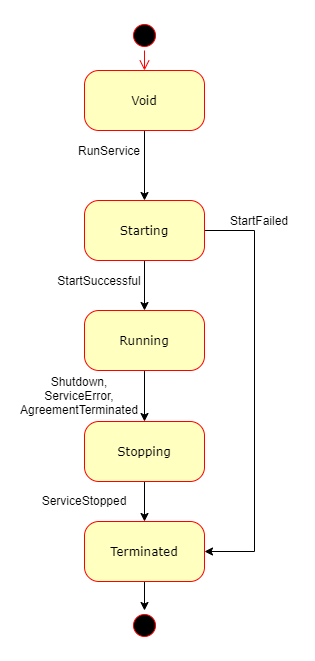

# How does it work? Dive into requestor agent \(service model\)

How can I host services in Golem network?

Golem allows you to launch and control interactive services. Contrary to batch processing tasks - which execute certain computations and finish once the results are ready - a service is, in general Golem terms, a process which runs under direct control of Provider, based on the Agreement with a Requestor, and responds to requests \(passed either via Golem network, or totally outside of Golem network's visibility\), until it is explicitly stopped \(usually by a Requestor\).

In Golem service model, the Requestor Agent application specifies the service which is to be instantiated, and then controls the service instance throughout its lifecycle in the Golem network.

## Service lifecycle

The Golem SDK provides an abstraction over Golem low-level APIs, which is aimed at building service-oriented applications straightforward for a developer. The abstraction is based on a logical concept of a Service. A Service is an entity which implements the logic of the service application, and from Requestor's perspective, follows a certain sequence of states:

Transitions from one state to another take place as a result of certain events. The events may be triggered by a Requestor \(RunService\), Provider \(AgreementTerminated\) or may be a result of an external phenomenon \(like errors of varying nature\). Golem SDK's Service programming model allows the developer to specify logic which is to be executed in subsequent "active" states of Service's lifecycle \(Starting, Running, Stopping\). The HL API controls the transitions between states and hides the "plumbing" of Golem mechanics so that the developer can focus on their service's details.

## Requestor Agent service application layout

The developer of a Golem service application needs to follow a certain pattern to implement fundamental aspects of service definition and control. A Service application includes an ExeUnit running on Provider node, and Requestor exercising control over that ExeUnit via Golem APIs. The ExeUnit can be eg. a VM hosting a specific payload application, or a bespoke ExeUnit controller/wraper which integrates a third-party service software with Golem ecosystem. In any case, the Service provisioned on Golem network will require certain aspects to be specified in the Requestor Agent application.

### Specify Demand

The Requestor Agent app must define the "payload" - the details specification of the service which is to be provisioned. This specification is then wrapped in a `Demand` structure and published on Golem market. A HL API library controls all aspects of Provider finding, negotiations and instantiating an Activity. The app needs to indicate the actions to be executed in subsequent "active" states of Service's lifecycle. 

### Define Starting logic

Once a Golem activity starts and the Service instance begins its life, the Requestor Agent must indicate all actions to be executed in order to setup the service.

This sequence of actions is executed only once in Service's lifecycle, and must result either with success, or indication of failure, in which case the Service immediately moves to Terminated state. 

### Define Running logic

Once started, the Service moves in Running mode - a normal state of operation. In this state, the Requestor Agent may eg. monitor & control the service \(either via Golem APIs or contacting the service directly via other means\).

Note that the Requestor Agent may at some point decide to end the service while it is in Running state - this ends the actions specified for Running state and triggers the transition to Stopping state.

### Define Stopping logic

In case the service gets halted, either by Reuqestor's decision, or due to Provider-triggered termination, the Service moves to a Stopping state, in which a Requestor Agent still may have an ability to eg. recover some artifacts from the service, or perform some general cleansweep.

Note that the Stopping actions are executed only once in Service's lifecycle.   

### Code example

So how does this look in practice?

TBC

