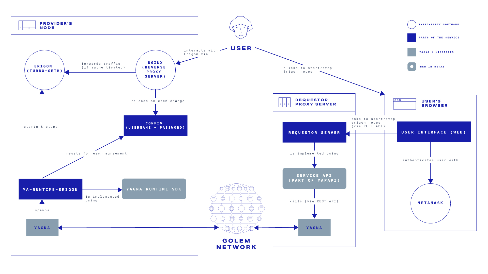

# Service Example 2: Managed Erigon

The purpose of this example is to demonstrate building a Golem service using a dedicated, self-contained runtime. It features an Ethereum network client, Erigon (f.k.a. Turbo-geth) started on provider nodes on user's demand. Interaction with the service, once it's running and its location and credentials have been passed to the requestor, is *not* facilitated by Golem though.


This example illustrates the following Golem features & aspects:

* Dedicated service runtime implemented with [ya-runtime-sdk](https://github.com/golemfactory/ya-runtime-sdk)
* Service management using [yapapi-service-manager](https://github.com/golemfactory/yapapi-service-manager)



All code for this example can be found in this repository: [https://github.com/golemfactory/yagna-service-erigon/](https://github.com/golemfactory/yagna-service-erigon/)


## Architecture overview



The application consists of three major components:

1. **User interface**  
   A browser-based interface written in TypeScript using [React](https://reactjs.org/). It allows the end user to interact with the application, i.e. start an Erigon node after authenticating with their [Metamask](https://metamask.io/) wallet, and later to manage their node(s).
2. **Requestor server**  
   A Python application developed using [Quart](https://pgjones.gitlab.io/quart/) and [yapapi-service-manager](https://github.com/golemfactory/yapapi-service-manager). It acts both as an HTTP server (handling requests from the user interface), and as a requestor agent (submitting tasks to the Golem network).
3. **Erigon runtime**  
    A dedicated, self-contained runtime created with [ya-runtime-sdk](https://github.com/golemfactory/ya-runtime-sdk). It is a Rust binary wrapping [Erigon](https://github.com/ledgerwatch/erigon) service itself so that it can be orchestrated by the yagna daemon. The runtime also controls the access to the service by managing [Nginx](https://www.nginx.com/) configuration.
   
A typical interaction flow proceeds in the following manner:

1. User opens the web interface in their browser.
2. User authenticates with their metamask wallet.
3. User clicks to start an Erigon node.
4. Request to start an Erigon node is sent via the REST API to the requestor server.
5. Requestor starts a service activity (these steps are handled by `yagna` core and `yapapi` internally):
    1. Requestor server makes a number of API calls to the yagna daemon running on the requestor's machine in order to find an available Erigon provider and sign an agreement.
    2. Once the agreement is signed, requestor server sends a command to the provider to start an Erigon node.
    3. Yagna daemon running on the provider's machine spawns an Erigon runtime process (a service wrapper/supervisor process).
8. Erigon runtime starts the actual Erigon service (backend & rpcdaemon processes).
9. Erigon runtime generates a new username and password and puts them in the NGINX configuration.
10. NGINX auto-reloads on configuration change, from now on granting access to the Erigon service only for user(s) authenticated with the newly-created credentials. (NGINX is continuously running on provider's machine as a daemon, so it doesn't need to be started.)
11. The credentials are passed backed to the requestor server along with provider's node's public IP address and the port on which NGINX is listening.
12. Requestor server passes all the received information to the web interface where it can be viewed by the user.
13. User interacts with the Erigon service (via NGINX proxy).
14. Once the user finishes using their Erigon instance, they click to stop it.
15. Web interface sends a request to stop the instance via the REST API to the requestor server.
16. Requestor server sends a stop command to the provider.
17. Erigon runtime stops the Erigon service and exits.
18. Requestor server orchestrates a payment for the service in the background without further user interaction.


The design presented above excludes making any payments for the service by its end user. This omission was made intentionally to make te service implementation simpler. It's not a problem as long as the service is used for demonstrative purpose only.  


## Runtime implementation

Here we demonstrate how self-contained Exe-Unit runtimes can be implemented, tested and finally plugged into the Provider's daemon.

:warning: Please be aware that custom Exe-Unit runtime doesn't provide the level of isolation comparable with gvmi image. It's just executable running with the same privileges that daemon does.

### Erigon runtime

First, lets discuss what is the purpose of the Erigon runtime to gain some high level overview.

* accepts the Ethereum network's name from the requestor agent,
* starts Erigon binaries to sync with the chosen network and serve Erigon RPC endpoint,
* generates credentials for basic authentication which is implemented with nginx
* credentials are returned to the requestor agent so user of the service can connect to the Erigon RPC.

Please refer to the "Provider's node" in the above Architecture overview diagram.

### Implementation

You might want to review simpler [example runtime](https://github.com/golemfactory/ya-runtime-sdk/blob/main/examples/example-runtime/src/main.rs) available in the [ya-runtime-sdk](https://github.com/golemfactory/ya-runtime-sdk/) repository.

Erigon runtime declares two structures

* `ErigonConf` - containing runtime configuration with default values,
* `ErigonRuntime` - derives from `RuntimeDef` implements the required methods from `ya-runtime-sdk::Runtime` trait

At least these methods from the `Runtime` trail have to be implemented but SDK provides default implementation to several others (TODO: link runtime SDK docs)

* `deploy` - usually called before any command is send to the runtime, but it's possible to call it explicitly by agent SDKs.
   It's run only once per activity, does not accept parameters (but there are plans to add them in the future release), return value is not passed to the requestor agent. In the Erigon runtime this method creates directories for Erigon data.

* `start` - called once per activity, accepts parameters, return value is not passed to the requestor agent. Analogically with `deploy` if not run explicitly via the SDK is run without parameters before any command is send to the runtime. In the Erigon runtime we use `start` method to receive the `network` parameter from the requestor, start Erigon's binaries and generate new credentials for nginx basic auth.

* `run_command` - called every time the corresponding agent SDK [`run`](runhttps://github.com/golemfactory/yagna-docs/blob/master/yapapi/api-reference.md#run) is called on the `WorkContext` object. Result can be obtained from the `WorkContext`'s results array after sequence of commands is executed by `commit`. In the Erigon runtime this method is used to provide Erigon service's credentials to the agent.

* `stop` - can be called explicitly by the requestor agent or automatically due to agreement termination. In the Erigon runtime `stop` method is used to kill Erigon processes started in `start`.

Note that the difference between `deploy` and `start` regarding the Erigon runtime might not be obvious. It's easier to think of them in terms of VM runtimes where `deploy` is needed for runtime preparation, e.g. download the image, after `start` runtime should be ready to run the commands.

### Extentions

Above methods corresponds to [`CLI::Command` enum](https://github.com/golemfactory/ya-runtime-sdk/blob/main/ya-runtime-sdk/src/cli.rs#L11). One can extend the default `CLI` by 

* derive `StructOpt` on the `CLI` struct
* decorate the runtime struct with `#[cli(<struct_name>)]`
* custom CLI arguments will be passed to each command by `runtime::Context`

Default [`RuntimeMode`](https://github.com/golemfactory/ya-runtime-sdk/blob/4be7534b61cd47ab8d1764d6fd840480744dbfba/ya-runtime-sdk/src/runtime.rs#L73) is `Server`.
In this mode runtime is deployed and then communicates with the `ExeUnit` via the `Runtime` API.
Another option is `RuntimeMode::Command` where each command is a separate invocation of the runtime binary. 

### Runtime configuration

During runtime startup the configuration file located in `$HOME/.local/share/ya-runtime-erigon/ya-runtime-erigon.json` is parsed and is initialising the instance of `ErigonConf` structure. If the file does not exists it will be created and initialized with default values during the first start of the runtime.

#### Example configuration file

```json
{
  "public_addr": "https://0.erigon.golem.network:8545",
  "data_dir": "/data/erigon",
  "passwd_tool_path": "htpasswd",
  "passwd_file_path": "/etc/nginx/erigon_htpasswd",
  "password_default_length": 15,
  "erigon_http_addr": "127.0.0.1",
  "erigon_http_port": "8555"
}
```

### Testing the runtime

Once needed SDK methods are implemented we can give our runtime a try in the [debugger](https://github.com/golemfactory/ya-runtime-dbg/).
For example our Erigon runtime can be executed in the debugger shell running the following command.

```bash
ya-ya-runtime-dbg \
  --runtime ./target/debug/ya-runtime-erigon \
  --workdir ./target/debug \
  --start-arg '{"network": "goerli"}'
```

Please mind it requires Erigon binaries present in the same directory (all needed binaries for Ubuntu Linux can be downloaded from the [binary release](https://github.com/golemfactory/yagna-service-erigon/releases/tag/ya-runtime-erigon-v0.1.0)). Also `htpasswd` from the `apache-tools` is needed to be present in the `PATH` but for the local testing you can mock it with `echo` changing configuration file property `"passwd_tool_path": "echo",`


### Pluging the runtime into `golemsp`

In the `$HOME/.local/lib/yagna/plugins/` directory create

* file `ya-runtime-erigon.json` where you describe the plugin
```json
[
  {
    "name": "erigon",
    "version": "0.1.0",
    "supervisor-path": "exe-unit",
    "runtime-path": "ya-runtime-erigon/ya-runtime-erigon",
    "description": "Service wrapper for Erigon (formelly Turbo-Geth)",
    "extra-args": ["--runtime-managed-image"]
  }
]
```

* directory `ya-runtime-erigon` (compare `runtime-path` in above file) where `ya-runtime-erigon` binary along with Erigon binaries are placed.

New runtime needs also to be enabled in `$HOME/.local/share/ya-provider/presets.json`. Preset object can be copied from other presets. 
Please note that `exeunit-name` has to match to the `name` property of the plugin above

```json
{
  "active": [
    "erigon",
    ...
  ],
  "presets": [
    {
      "name": "erigon",
      "exeunit-name": "erigon",
      "pricing-model": "linear",
      "usage-coeffs": { ... }
    },

```

## Requestor agent

This part of the tutorial directly corresponds to the two previous requestor tutorials ([services hello world example](service-example-0-hello-world.md) and [simple service](service-example-1-simple-service.md)). We have the same clear separation between service specification and service provisioning, but there are important differences:

* We use Erigon runtime instead of a VM-based runtime (so we don't have any Dockerfile or `image_hash`).
* We don't implement `async def run` - the service is only started/stopped, requestor is idle when the service it is running.
* We use [yapapi-service-manager](https://github.com/golemfactory/yapapi-service-manager) instead of pure `yapapi`.
* We integrate the requestor code with [Quart](https://pgjones.gitlab.io/quart/), a web framework.

### Service specification

As in previous tutorials, service specification is a subclass of `yapapi.Service`.
Full code is available in the [yagna-erigon-repo](https://github.com/golemfactory/yagna-service-erigon/blob/master/requestor/server/erigon_service.py), here we'll discuss the important parts.

#### Initialization:

```python
class Erigon(Service):
    def __init__(self, *args, **kwargs):
        super().__init__(*args, **kwargs)
        self.url = None
        self.auth = None
        self.network = None
```

We add three attributes that are specific to our service logic:

* `url` - where Erigolem RPC (running on the provider) will be accepting requests
* `auth` - credentials that must be provided with each request
* `network` - Ethereum network name 

They are initialized to `None` and later - when the service starts - will be updated with the data acquired from the runtime.


We have no control of the `Erigon` service class initialization, so the

```python
def __init__(self, *args, **kwargs):
    super().__init__(*args, **kwargs)
```

part is required.


#### Payload

The payload is defined in [ErigonPayload](https://github.com/golemfactory/yagna-service-erigon/blob/master/requestor/server/erigon_payload.py) class:

```python
ERIGON_RUNTIME_NAME = "erigon"

@dataclass
class ErigonPayload(Payload):
    runtime: str = constraint(inf.INF_RUNTIME_NAME, "=", ERIGON_RUNTIME_NAME)
    min_mem_gib: float = constraint(inf.INF_MEM, ">=", 0.5)
```

and used in `get_payload` in the service:

```python
@classmethod
async def get_payload(cls):
    return ErigonPayload()
```

Few important things to note here:

* We don't have any `image_hash` (contrary to the previouse examples) because we don't use a VM-based runtime.
* We declare the runtime name, `erigon` - this must match the offered [exeunit-name](#pluging-the-runtime-into-golemsp).
* `min_mem_gib` - minimum amount of RAM the provider has to offer. This is pretty useless in the Erigon case (contrary to the e.g. VM-based runtimes), but is required because of a known `yapapi` [bug](https://github.com/golemfactory/yapapi/issues/500).


#### Start

```python
async def start(self):
    #   startup - set start args (network parameter)
    self._ctx.deploy()
    start_args = await self._get_start_args()
    if start_args:
        erigon_init_args = start_args[0]
        erigon_init_args_str = json.dumps(erigon_init_args)
        self._ctx.start(erigon_init_args_str)
    else:
        self._ctx.start()

    #   Set url & auth
    self._ctx.run('STATUS')
    processing_future = yield self._ctx.commit()
    result = self._parse_status_result(processing_future.result())
    self.url, self.auth, self.network = result['url'], result['auth'], result['network']
```

Let's split that to separate parts.

##### Deploy

```python
self._ctx.deploy()
```

This is the first thing that should always be done with `self._ctx`.

##### Determine start args

```python
start_args = await self._get_start_args()
```

`start_args` - in the erigon case - are a single-item tuple:

```python
(
    {'network': <ETHEREUM NETWORK NAME>},
)
```

These `start_args` are defined by the final user (the one ordering Erigon service, e.g. via the web interface) and passed directly to the runtime.


Current `yapapi` has no pretty way of passing arguments to the `Service`, so this is implemented as an ugly-but-harmless hack:

```python
async def _get_start_args(self):
    while True:
        try:
            return self._cluster.instance_start_args
        except AttributeError:
            await asyncio.sleep(0.1)
```

This will be addressed in [the near future](https://github.com/golemfactory/yapapi/issues/372).



##### Start

```python
if start_args:
    erigon_init_args = start_args[0]
    erigon_init_args_str = json.dumps(erigon_init_args)
    self._ctx.start(erigon_init_args_str)
else:
    self._ctx.start()
```


`start_args` is expected to be a tuple, but there are no more assumptions - they are just passed here from the [code that starts the service](#create-a-new-erigon).
The Erigon runtime expects at most one argument and it is expected to be a `json`, so we send the serialized first argument (or start without any arguments if `start_args` are empty).
This could be also a good place to perform a requestor-side validation, we validate `start_arg` only in the runtime.

##### Perform a STATUS command

```python
self._ctx.run('STATUS')
```

Run a command 'STATUS'. Actually, we could send anything other than `STATUS` - our runtime ignores the command and does always the same thing - returns running erigon url, credentials and Ethereum's network.



Compare this to VM-based commands, like

```python
self._ctx.run('/bin/date')
self._ctx.run('/bin/sh', '-c', 'cat some_file.txt')
```
etc.

In the VM environment, available commands are defined in the image and they usually default to commands available in the base linux image + optional additional commands, like `/golem/run/simple_service.py` in the [simple service](service-example-1-simple-service.md).
When using a custom runtime, we are free to implement any commands we want - but also we have no built-in commands, not even `ls`.


#####  Fetch the results

```python
processing_future = yield self._ctx.commit()
result = self._parse_status_result(processing_future.result())
self.url, self.auth, self.network = result['url'], result['auth'], result['network']
```

```python
def _parse_status_result(self, raw_data: 'List[CommandExecuted]'):
    command_executed = raw_data[-1]

    erigon_data = command_executed.stdout
    erigon_data = json.loads(erigon_data)
    return erigon_data
```

STATUS command executed in the runtime returns JSON-serialized data. On the requestor side it is available in `stdout` of the appropriate `command_executed`.



`processing_future.results()` is a list of CommandExecuted objects - one per each command. In our case, there are three : `deploy`, `start`, and `run(STATUS)`, and we are interested only in the output of the last one.




#### Run & shutdown

We don't need to implement those functions because the default `yapapi.Service` implementation is exactly what we want:

* Default `run()` waits forever.
* Default `shutdown()` terminates the agreement. We don't have to perform any additional cleanup - it is already implemented in the runtime (e.g. erigon process is stopped).


### Running the HTTP Erigon server

We implement an HTTP server that responds to 3 requests:

* `createInstance` - start a new erigon,
* `stopInstance/<id>` - stop this erigon,
* `getInstances` - list all current & past erigons.

There is also some basic authentication - the only user who can see/stop an erigon is the one who created it.
We use the [Quart](https://pgjones.gitlab.io/quart/) framework.




Code that uses `yapapi` must be called in an asynchronous context. Quart is an `async` equivalent of the much more popular [Flask](https://flask.palletsprojects.com/en/2.0.x/).



Full server code is [here](https://github.com/golemfactory/yagna-service-erigon/blob/master/requestor/server/app.py), only Golem-related part will be discussed in this tutorial.

For the documentation on `yapapi-service-manager` check [README](https://github.com/golemfactory/yapapi-service-manager).

#### Configuration

([run\_server.py](https://github.com/golemfactory/yagna-service-erigon/blob/master/requestor/run_server.py))
```python
app.yapapi_executor_config = {
    'budget': 10,
    'subnet_tag': os.environ.get('SUBNET_TAG', 'erigon'),
}
```

Here we define the `yapapi.Golem` [init\_args](https://handbook.golem.network/yapapi/api-reference#_engine-objects).
`app.yapapi_executor_config` is passed directly to the `Golem` object.

#### Start/stop the requestor


```python
from yapapi_service_manager import ServiceManager

@app.before_serving
async def start_service_manager():
    app.service_manager = ServiceManager(app.yapapi_executor_config)


@app.after_serving
async def close_service_manager():
    await app.service_manager.close()
```

We initialize the ServiceManager during the server startup and close it when the server exits.
This is (roughly) equivalent to entering/exiting `async with Golem`.



There is no state preserved outside of the process memory, so when using a generic WSGI server (like `gunicorn`) you shouldn't
* Start more than one worker,
* Use worker-recycling tools (like `max_requests` in `gunicorn`).




#### Create a new Erigon

```python
from .erigon_service import Erigon
from .erigon_service_wrapper import ErigonServiceWrapper

@app.route('/createInstance', methods=['POST'])
async def create_instance():
    request_data, user_id, init_params = [some_non_golem_stuff]

    erigon = app.service_manager.create_service(Erigon, (init_params,), ErigonServiceWrapper)

    erigon.name = request_data.get('name', f'erigon_{erigon.id}')
    app.user_erigons[user_id][erigon.id] = erigon

    return erigon.api_repr(), 201
```

First, we extract `request_data`, `user_id` and `init_params` from the request, this is done in a pretty standard `Quart`ish way.

Then comes the most important line:

```python
erigon = app.service_manager.create_service(Erigon, [init_params], ErigonServiceWrapper)
```

`Erigon` is the `yapapi.Service`-based class we implemented in the [previous section](#service-specification).

`init_params` is a dictionary `{'network': <ETHEREUM-NETWORK-NAME>}` that is defined in the request.

`ErigonServiceWrapper` is a class extending `yapapi-service-manager.ServiceWrapper` that can be found [here](https://github.com/golemfactory/yagna-service-erigon/blob/master/requestor/server/erigon_service_wrapper.py). It is neither very important nor interesting: we just need a place to store and access some additional erigon-specific information, like `created_at` timestamp or `name`.
This could be implemented in many different ways, but this is the most convenient - the returned `erigon` object (an instance of `ErigonServiceWrapper`) encapsulates all of the logic and has exactly the interface we need:

```python
erigon.name         # user-defined name
erigon.api_repr()   # representation of the erigon, sent to the frontend
erigon.stop()       # stops the service (service starts when the object is created)
```

In the next three lines:

```python
erigon.name = request_data.get('name', f'erigon_{erigon.id}')
app.user_erigons[user_id][erigon.id] = erigon
return erigon.api_repr(), 201
```
We set the Erigon name, save the information about newly created Erigon, and send its representation as a response.

#### Stop the erigon

```python
@app.route('/stopInstance/<erigon_id>', methods=['POST'])
async def stop_instance(erigon_id):
    user_id = get_user_id()

    try:
        erigon = this_user_erigons[erigon_id]
    except KeyError:
        return 'Invalid erigon_id', 404

    erigon.stop()

    return erigon.api_repr(), 200
```

Nothing really interesting here, we just:

* Extract the `user_id` from the request
* Check if this is the user who created this Erigon (compare the `app.user_erigons[user_id][erigon.id] = erigon` line in the previous section),
* Stop the Erigon - this *initializes* the stopping process, it is not stopped immediately (because stopping needs some action on the provider side),
* Return Erigon representation as a response.

#### Get all user's Erigons

```python
@app.route('/getInstances', methods=['GET'])
async def get_instances():
    user_id = get_user_id()
    erigons = app.user_erigons[user_id].values()
    data = [erigon.api_repr() for erigon in erigons]
    return json.dumps(data), 200
```

We select all Erigons created by the user and return their representation.

### Running the service with a simple script

There is also a [simple script that just starts the erigon services](https://github.com/golemfactory/yagna-service-erigon/blob/master/requestor/run_erigon_service.py). Service is running forever, status is printed every second, ctrl+C leads to a graceful shutdown. This is just a development tool, similar to [yapapi-service-manager examples](https://github.com/golemfactory/yapapi-service-manager/tree/master/examples).

