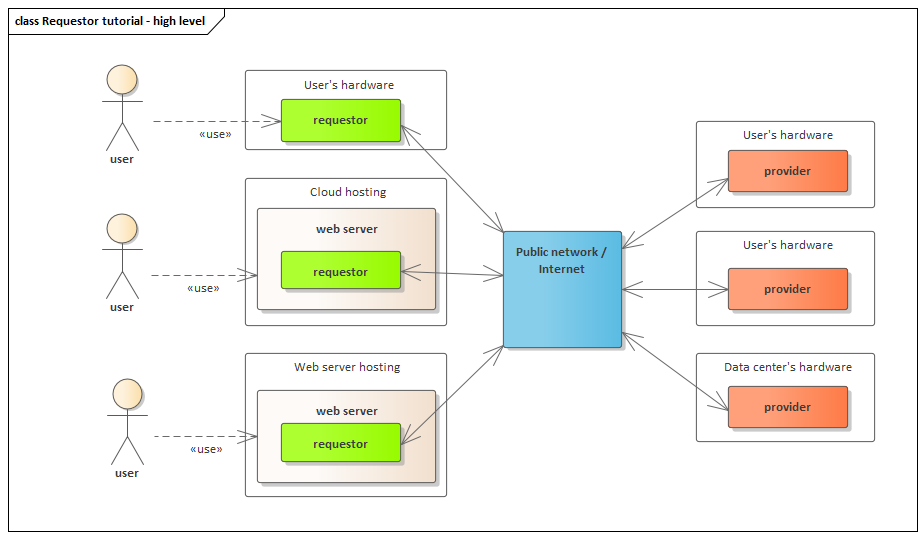
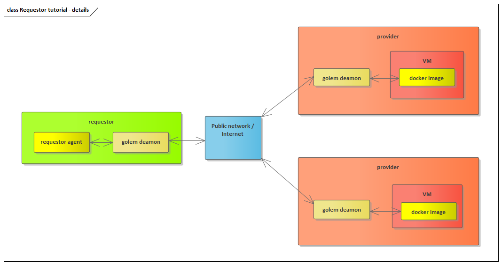
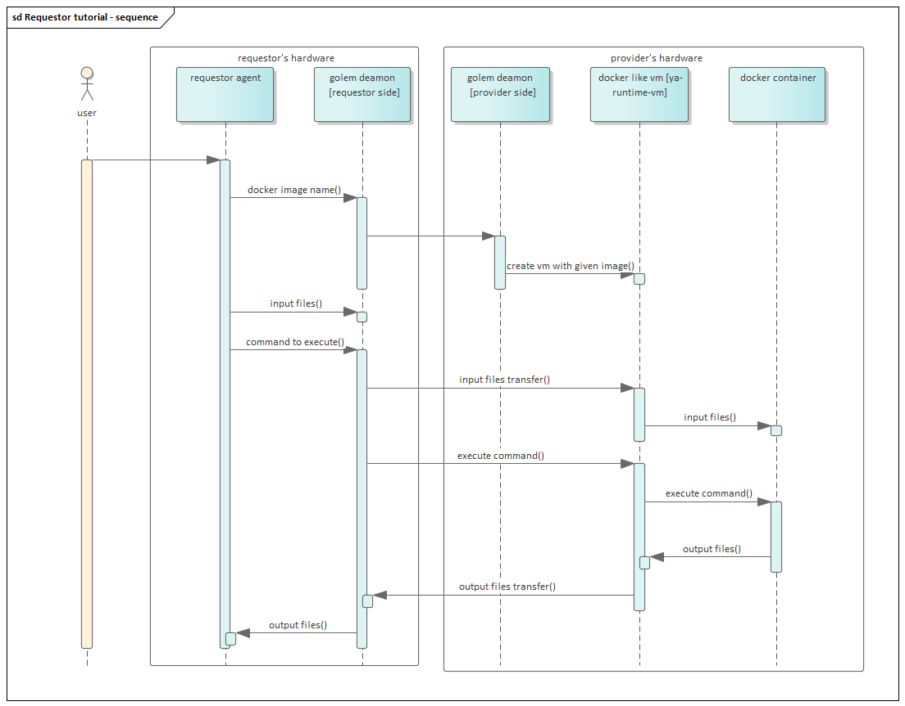

# Requestor development tutorial

## What is golem network ?

Golem network is decentralized marketplace where IT resources such as computation hardware are bought and sold. The network consists of two types of actors:

* **Requestor**

Has a need to use some IT resources such as computation hardware. Those resources are purchased in the decentralized market. Also the actual usage of the resources is backed by the golem network decentralized infrastructure.  

* **Provider**

Has IT resources that can be shared with other actors in the network. Those resources are sold in the decentralized market.



Both requestors and providers may be launched on different types of hardware. Those can be laptops, desktop computers, servers and cloud environments. For the requestors it is also feasible to be executed on mobile devices.

## What does a requestor do?

Typical use case for the requestor is as follows:

* **Define the need**

Define the IT resources it needs. Those needs \(for example CPU and memory requirements\) would be than by the golem infrastructure published in the decentralized network in a form of so called Order. 

* **Buy the resources**

If in the decentralized market there are Offers that match requirements of the Order, the resources offered by the provider are both to be used by the requestor.

* **Use the resources**

The actual usage depends on the resources. For now most common scenario is performing computations, but golem network is not limited to this use case.

* **Pay for the resources usage**

The last step is to pay for the usage of the resources \(unless the provider is offering them for free :\). There are many possible payment scenarios, but Ethereum based payment is default one.

## How can I benefit?

Typical benefit for the requestor is being able to have instant access to very large pool of computational hardware.  Instead of using local hardware, the requestor is able to use IT resources available on the decentralized market. 

**Please bear in mind that one requestor can use hardware from many providers at the same time.** Think about training large ML model in seconds instead of hours. This is just an example, as there are many interesting business use cases described in the:



For the basic computations scenario the details of the resource usage are as follows:

Specify what docker image to use  / create custom docker image.

For each of the used providers \(there is no limit here on the number :\) define the files containing the input data for the computations.


## How can I run my job over golem network?

In order to run your own payload over golem network, you need to write a requestor agent suited to the work you'd like to have executed by the network's providers.

In this tutorial, we'll show you how to do just that.

There are a couple of assumptions we'll be making here:

* your task is easily splittable and follows a simple map-reduce model in which the input for the whole task is known beforehand and the result is constructed directly from the singular outputs produced from each subset of the input - in other words, that the input of each split task does not depend on an output of another split task 
* your payload can be executed inside an isolated container and doesn't - by itself - need to access the outside world


## Development

### Prerequisites

To proceed with this, quite focused tutorial, you'll first need to ensure the following prerequisites are met:

* you have `yagna` daemon running - this is the main service of the new Golem that's responsible for keeping connections with all the other nodes in the network. It exposes its REST API to allow both the provider and the requestor agents to connect to it.
* you have the `yagna` app key generated and noted down so you can use it while running the requestor agent.
* you have the `gftp` binary used to transport files over golem network
* you have your docker image prepared using our `gvmkit` - a tool that converts a docker image to an optimized format better suited for distribution over golem network. This tutorial uses an already converted image containing the Blender renderer which we'll be using to run our tasks, so you can skip this step for now.
* you have `python` &gt;= 3.6 installed and a virtual environment created - it's needed to run our example here.
* as we'll be using the Blender renderer in this tutorial, you'll need a Blender scene file that the providers will render for you. You can use the scene we've been using for our tests: [https://github.com/golemfactory/golem/raw/develop/scripts/node\_integration\_tests/tasks/cubes/cubes.blend](https://github.com/golemfactory/golem/raw/develop/scripts/node_integration_tests/tasks/cubes/cubes.blend) **\[ possibly, replace with a link to a scene accompanying the example code in the `yapapi` repo \]** 
* finally, some familiarity with `asyncio` is a plus as `yapapi` is written to make heavy use of Python's `asyncio` library.

#### Running `yagna` daemon from sources

To run `yagna` from sources, you'll need to have `rust` development environment installed - it will be needed to run the `yagna` daemon itself. If you don't have it, please refer to the official docs to install it: [https://www.rust-lang.org/learn/get-started](https://www.rust-lang.org/learn/get-started) 

Afterwards, you'll need to launch the `yagna` service.

First, clone the `yagna` repository from: [https://github.com/golemfactory/yagna/](https://github.com/golemfactory/yagna/releases/tag/vm-poc)

Once you have it cloned and checked out, enter its directory and:

first, copy the template environment file onto a proper .env file:

```text
cp .env-template .env
```

 then run:

```text
cargo run service run
```

This will build the `yagna` using the Rust compiler \(which can take a considerable time unless you're working on a really fast machine\) and subsequently launch it.

Once the daemon launches, it will start emitting some debug messages among which one of the first ones will look like: `[2020-07-16T12:11:33Z INFO yagna] Starting yagna service!` .  There you go! Leave the shell with the yagna service running and you're ready for the following steps.

#### Generate the app key

With the daemon running, enter the daemon's directory using another shell and generate the `yagna` app key that will be used by your requestor agent to access yagna's REST API.

```text
cargo run app-key create requestor
```

This should produce a 32-character-long hexadecimal app key that you need to note down as it will be needed to run the requestor agent.

In case you lose your app key, you can retrieve it with:

```text
cargo run app-key list
```

the value in the `key` column is the key you need.

#### Build the `gftp` binary

If you're running `yagna` from sources, you won't have the `gftp` binary around and you need to also build it yourself. To do so, once again, go to your `yagna` source directory and execute:

```text
cd core/gftp
cargo install --path .
```

This will build and install the `gftp` binary for you.

#### Ensure you have some ETH and GNT tokens ready

```text
cargo run payment init -r
```

and allow a few minutes for the faucet to do its job.

You can verify whether you already have the funds with:

```text
cargo run payment status
```

If it doesn't succeed after a few minutes, re-run the `payment init` command above and check again after a few more minutes.

### Requestor agent code

```text
from yapapi.runner import Engine, Task, vm
from yapapi.runner.ctx import WorkContext
from datetime import timedelta
import asyncio


async def main():
    package = await vm.repo(
        image_hash="9a3b5d67b0b27746283cb5f287c13eab1beaa12d92a9f536b747c7ae",
        min_mem_gib=0.5,
        min_storage_gib=2.0,
    )

    async def worker(ctx: WorkContext, tasks):
        ctx.send_file("./cubes.blend", "/golem/resource/scene.blend")
        async for task in tasks:
            frame = task.data
            ctx.begin()
            crops = [{"outfilebasename": "out", "borders_x": [0.0, 1.0], "borders_y": [0.0, 1.0]}]
            ctx.send_json(
                "/golem/work/params.json",
                {
                    "scene_file": "/golem/resource/scene.blend",
                    "resolution": (800, 600),
                    "use_compositing": False,
                    "crops": crops,
                    "samples": 100,
                    "frames": [frame],
                    "output_format": "PNG",
                    "RESOURCES_DIR": "/golem/resources",
                    "WORK_DIR": "/golem/work",
                    "OUTPUT_DIR": "/golem/output",
                },
            )
            ctx.run("/golem/entrypoints/run-blender.sh")
            ctx.download_file(f"/golem/output/out{frame:04d}.png", f"output_{frame}.png")
            yield ctx.commit()

            task.accept_task()

        ctx.log("no more frames to render")

    async with Engine(
        package=package, max_workers=10, budget=10.0, timeout=timedelta(minutes=15), subnet_tag="demo-1"
    ) as engine:

        async for progress in engine.map(worker, [Task(data=frame) for frame in range(0, 60, 10)]):

            print("progress=", progress)


if __name__ == "__main__":
    loop = asyncio.get_event_loop()
    task = loop.create_task(main())
    try:
        asyncio.get_event_loop().run_until_complete(task)
    except (Exception, KeyboardInterrupt) as e:
        print(e)
        task.cancel()
        asyncio.get_event_loop().run_until_complete(asyncio.sleep(0.3))

```

### How does it work?


TE OBRAZKI TO TU RACZEJ NIE PASUJĄ: ... CHYBA, ŻE TEN DRUGI... 







Okay, we'll skip over the imports at the top and `asyncio` boilerplate code at the bottom of the example and we'll jump straight into the body of the `main()` routine.


#### Specify your demand

Normally, you'd need to adapt your docker image to golem using `gvmkit` **\[LINK TO GMVKIT\]**  but for the purpose of this tutorial, we're using the pre-converted image containing the Blender renderer.

So, first, we need to specify which image we'll be using and what its memory and disk space requirements are:

```text
    package = await vm.repo(
        image_hash="9a3b5d67b0b27746283cb5f287c13eab1beaa12d92a9f536b747c7ae",
        min_mem_gib=0.5,
        min_storage_gib=2.0,
    )
```

As you can see, we're pointing to an image within our GVM repository using the hash of the Blender image and we're indicating that it requires half a gigabyte of RAM and 2 gigabytes of disk space.

This, effectively creates a `Demand` for the market to respond to. In other words, it communicates to the market that our requestor wants to have the specified image executed with at least the specified amounts of RAM and disk space. 


#### Define your task's steps

After you have specified the image to run, you need to define the steps that need to be executed by the providers in order to perform your task successfully.

Our high level API abstracts the minute details of the operations that need to take place between the requestor agent and the providers' end during the execution of the task and its fragments and provides a convenient way specify the needed steps in a routine that is to be performed for each provider which executes the task fragments assigned to it.

We'll now take the `worker` routine apart, to understand what's happening:

```text
    async def worker(ctx: WorkContext, tasks):
```

The routine is called with a `ctx` object that contains the work context for a single provider who executes the fragments of the task assigned to them. `tasks` is a generator that provides tasks from a common queue in an asynchronous way so that each provider can take another task from the queue as soon as they finish the previous one. The execution continues for as long as there are tasks in the queue.

In this example, we're using a single scene file which all task fragments use so it only needs to be sent and attached to the provider when the container is first deployed on provider's end:

```text
        ctx.send_file("./cubes.blend", "/golem/resource/scene.blend")
```

The first parameter to `send_file()` here is the local path of the file and the second one is the path within the _container_ on provider's end to which this file should be copied once the container is deployed.

Then, there is a sequence of steps that needs to be executed for each of the fragments that this provider receives wrapped with this asynchronous loop:

```text
        async for task in tasks:
```

The next few lines are very specific to the Blender use case and the vm image we're using to render each piece of the output. There are a lot of parameters that can be defined here which are mostly irrelevant in the context of a general requestor development tutorial so we'll just go throught what's most important.

```text
            frame = task.data
            ctx.begin()
            crops = [{"outfilebasename": "out", "borders_x": [0.0, 1.0], "borders_y": [0.0, 1.0]}]
            ctx.send_json(
                "/golem/work/params.json",
                {
                    "scene_file": "/golem/resource/scene.blend",
                    "resolution": (800, 600),
                    "use_compositing": False,
                    "crops": crops,
                    "samples": 100,
                    "frames": [frame],
                    "output_format": "PNG",
                    "RESOURCES_DIR": "/golem/resources",
                    "WORK_DIR": "/golem/work",
                    "OUTPUT_DIR": "/golem/output",
                },
            )

```

For the sake of simplicity, we have decided to render whole frames of the scene so that the output of each task fragment is a single frame and no subsequent merging of pieces of images is required. The output of a whole task then is just a sequence of images, the merging of which into e.g. a movie file is beyond the scope of this tutorial.

Thus, the `crops` parameter \(which can be used to specify a part of a frame\) stays the same between the tasks and what varies is the `frames` parameter that specifies the frame range to render within each task fragment.

We're using `ctx.begin()` to start the sequence of commands for this specific fragment and then`ctx.send_json()` to wrap the provided dictionary of parameters into a JSON file, the destination path of which is passed as the first parameter. Note that this destination path is again a location within the container that's executed on provider's end.

As you can see, the `frame` parameter comes from the `data` field of the `Task` objects that are passed into the `Engine`'s `map` function later on in the code. We could have just as well filled the `data` with e.g. a dictionary containing crop parameters for each fragment - if we wanted to render different parts of images on each fragment's execution. Or we could fill it with names of different scene files if e.g. we wanted each task to render a completely different scene file. Of course, in this latter case, we'd also need to use `ctx.send_file()` to send a new scene file for each new task fragment.

**TLDR**, the most important take-away here is that `send_json` provides an easy way to pass a dictionary of parameters into the execution container and that you pass parameters for each task fragment in the `data` field of the `Task` objects passed to the `map` function. 

Okay, next we have the most important step:

```text
            ctx.run("/golem/entrypoints/run-blender.sh")
```

which, of course, causes a specific `run` command to be executed by the Docker container on provider's end. Again, in this case, this script is pretty specific to the use case at hand and knows that it needs to take the `params.json` file and use it to call `Blender` in such a way as to render the desired content.

Still, you could just as well run any other command in the container's shell, by also providing its arguments as subsequent parameters to the `run()` function.

After the command finishes its execution, it's time to pass the results back to the requestor:

```text
            ctx.download_file(f"/golem/output/out{frame:04d}.png", f"output_{frame}.png")
```

The first parameter here is the source path - which refers to a path within the container on provider's end - and the second one is the local path on our requestor machine to which the output should be written.

Finally - or _almost_ finally - we issue a `commit()` call which combines all the steps together and we pass them using `yield` to the `Engine` which, in turn, passes them for execution and allows the flows for other providers to be executed on our requestor while this provider works on this task fragment.

```text
            yield ctx.commit()
```

Eventually, when the execution returns to our routine and to the work context of the specific provider, we should already have the results available in the desired location.

Ordinarily, you'd most likely want to run some verification of the result to make sure that the provider has done a proper job but here, again, for simplicity's sake, we'll just accept the task as it is.

```text
            task.accept_task()
```

And, if the queue is empty and thus the loop is ended, we can finalize the work context of the specific provider - here, just by stating that we see no more frames to render.

```text
        ctx.log("no more frames to render")
```


#### Time to call the runner Engine

With our task \(fragment\) steps defined, we can finally call the `Engine` that will orchestrate first the negotiation of our computational `Demand` against the `Offer`s from the providers in the network to reach agreements with each of them and subsequently will use those agreements to launch specific computational activities to complete the task we have specified. **\[ WHAT ABOUT THE PAYMENTS? \]**

The `Engine` is first instantiated as a context manager:

```text
    async with Engine(
        package=package, max_workers=10, budget=10.0, timeout=timedelta(minutes=15), subnet_tag="demo-1"
    ) as engine:

```

The `package` here is effectively our `Demand` that we have created above, `max_workers` specifies the maximum number of providers we want to be working on our task, `budget` specifies the maximum budget \(in GNT\) that this task may utilize **\[ ENSURE IT'S THE BUDGET FOR THE WHOLE THING AND NOT PER-FRAGMENT \],** `timeout` is the time after which we absolutely want our whole task to be finished by and after which we'll treat it as failed unless it's already finished and finally, the `subnet_tag` serves to select a subset of the network that our requestor node wants to limit its communications to.

The last parameter means that if we do specify the subnet - each and every provider who wants to execute our tasks must be running with the same `subnet` parameter. 

With the `Engine` in place, we can finally tell it what we want to execute and also _how_ we want to define each fragment.


```text
        async for progress in engine.map(worker, [Task(data=frame) for frame in range(0, 60, 10)]):
            print("progress=", progress)

```

As has been mentioned previously, the first parameter to `map` is the worker routine that defines our task's steps and the second parameter is an iterable defining all the fragments of our whole task that we desire to be executed.

Here we're passing it the specifc `frame` from the scene that we'd like our Blender container to render but it can essentially be any parameter or set of parameters that can accurately describe the job to be executed and it is up for our `worker` routine and - through it - for our containerized payload to make sense of what that set of parameters is.


#### YAY!

With this, our requestor agent is complete and we can use it to run our computational payload on the new golem network.


## Running the requestor

To run the above code:

* prepare virtual environment for the tutorial script, e.g. with `virtualenvwrapper`:
  * `mkvirtualenv -p python3 yagna-python-tutorial`
* and install the dependencies:
  * `pip install yapapi certifi`
* copy the above example python requestor code and place it as `example.py` in the same directory as your blender scene file
* if you're using a scene file with a different name than `cubes.blend` above make sure that your example code refers to your scene file
* set the `YAGNA_APPKEY` to the app key that you received after you have created the yagna app key
  * `export YAGNA_APPKEY=insert-your-32-char-app-key-here` 
* and run the requestor agent:
  * `python3 ./example.py`

## Next steps

