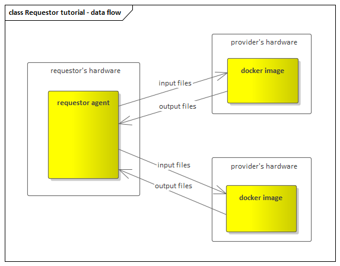

# Requestor tutorial

## What is golem network ?

## What does requestor do?

## How can I benefit?

## How can I develop golem network requestor?

## Development

### Prerequsites

### Requestor agent code

### How does it work?

## Running the requestor

## Next steps

