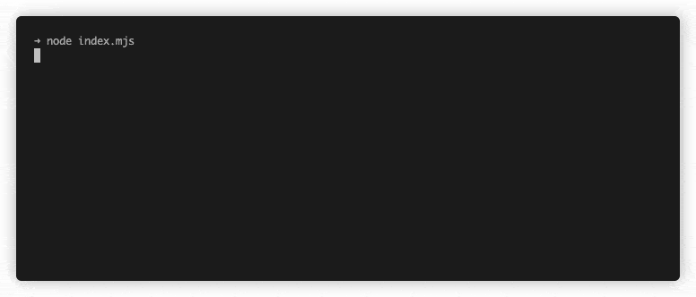

# QuickStart

In this article, we'll show you how to launch your first JavaScript app on Golem Network from scratch in 15 minutes. The 
result of the application will be to run the JS file using Node JS on the provider's machine and return the result. We 
have divided the entire article into 5 sections:

* [Preparing the environment](quickstart.md#preparing-the-environment)
* [Installing yagna requestor](quickstart.md#installing-yagna-requestor)
* [Building your first JavaScript application on Golem Network](quickstart.md#building-your-first-javascript-app-on-golem-network)
* [Run node script on provider](quickstart.md#run-the-app)
* [Extend app functionality](quickstart.md#extend-app-functionality)

The first two sections are duplicated with the more elaborate ones described elsewhere in the handbook. However, the 
purpose of this article is not to get into the details, but to show you **how to start working with Golem step by step 
in minutes**.

If you have a development environment already configured, you can go ahead and skip the first section and move on to 
the next one.

If you have already installed the yaggna daemon and configured the requestor correctly, go straight to the third 
section.

## Preparing the environment


#### Prerequisites

* OS X 10.14+, Ubuntu 18.04 or 20.04 or Windows
* Familiarity with the command line
* Install [Node.js](https://nodejs.org/) version 16.19.x


In this section we will introduce how to run a Simple Node Application on Golem Network. The created project will be 
using a build setup based on pre-built [Golem Image](../requestor-tutorials/vm-runtime/) and allow us to run Node.js 
script on [Provider](../introduction/provider/).

Make sure you have a 16.19.x version of Node.js installed:

```bash
node --version
```

### Installing yagna requestor

To start working with Golem network we need to install `yagna` daemon locally. In the simplest terms, the daemon 
allows you to communicate with Golem Network and perform operations on it.



**Easy installation**

You can install it using our helper script like this:

```bash
curl -sSf https://join.golem.network/as-requestor | bash -
```

You might be asked to modify your PATH afterwards.


On Windows, only the manual installation is supported.




**Manual installation on Windows**

Alternatively, if you can't install in easy way, you will do it manually in the following way:

1. Download the requestor package - prefixed `golem-requestor` - appropriate for your platform from: [https://github.com/golemfactory/yagna/releases/tag/v0.12.0](https://github.com/golemfactory/yagna/releases/tag/v0.12.0)
2. Unzip the archive to extract the two files: `yagna.exe` and `gftp.exe`.
3. Copy those files to `C:\Windows\System32`



**Manual installation on Unix**

Alternatively, if you can't install in easy way, you will do it manually in the following way:

1. Download the requestor package - prefixed `golem-requestor` - appropriate for your platform from: [https://github.com/golemfactory/yagna/releases/tag/v0.12.0](https://github.com/golemfactory/yagna/releases/tag/v0.12.0)
2. Unpack `yagna` and `gftp` binaries and put within somewhere in your PATH (e.g. copy them to /usr/local/bin on Unix-like systems) or add the directory you placed the binaries in to your PATH



Verify if `yagna` available in command line:

```bash
yagna --version
```

It should output: `yagna 0.12.0 (37060503 2022-12-02 build #251)`

Verify if `gftp` available in command line:

```bash
gftp --version
```

It should output: `gftp 0.12.0 (37060503 2022-12-02 build #251)`

If the above commands executed correctly, congratulations you have just installed the `yagna` daemon in your environment.


If you have encountered problems, or would you like to learn more details about the requestor and `yagna` installation, 
please take a look in here: [How to install requestor tutorial](../requestor-tutorials/flash-tutorial-of-requestor-development/)


### Configure requestor and fund your wallet

To start using Golem Network you need a key, which will be also be the address of your wallet. For the purposes of 
this tutorial we are using testnet. To generate a key and fund your wallet follow these steps:

#### Firstly, start the daemon

To perform any operations on the Golem Network the `yagna` daemon must be running. To do this, open a command line 
window and type:

```bash
yagna service run
```


Important: After you launch the daemon, leave it running in the background while you proceed with the tutorial.



If you have encountered problems please take look on 
[Run the daemon](../requestor-tutorials/flash-tutorial-of-requestor-development/#run-the-daemon) section


#### Secondly, generate the app key (wallet)

To use the network you must have your own unique key(wallet) for which is used for billing. To generate the key, make 
sure you have running `yagna` daemon from the [previous step](quickstart.md#firstly-start-the-daemon), leave it running 
in the background and in a separate command line window type in:

```bash
yagna app-key create requestor
```

**Please, note the key down**

#### Thirdly, get some funds

In order to be able to request tasks on Golem Network, you'll need some GLM tokens. To get some funds on testnet, type 
in:

```bash
yagna payment fund
```

Once you run the command, give some time to transfer funds to your wallet. You can verify whether you already got the 
funds with:

```bash
yagna payment status
```


If you have encountered problems, or would you like to learn more details about the funding process, please take a look 
in here: 
[How to get some GLM tokens](../requestor-tutorials/flash-tutorial-of-requestor-development/#get-some-test-glm-tokens)


## Building your first JavaScript app on Golem Network

Congratulations you are now ready to start building your first JavaScript app on the Golem Network.

### Create a new Node project

Create a new node project by typing in the command line:

```bash
mkdir golem-tutorial-js
cd golem-tutorial-js
npm init
```

### Create a node script that will execute task on provider

Add `yajsapi` to your project:

```bask
npm install yajsapi
```

### Your first app on Golem Network

Let's create a simple code that will run a command displaying the node JS version on the provider.
For this purpose we would like to call the command `node -v`. 
Let's create `index.mjs` file that looks like the following:


```js
import { TaskExecutor } from "yajsapi";

(async () => {
   const executor = await TaskExecutor.create("529f7fdaf1cf46ce3126eb6bbcd3b213c314fe8fe884914f5d1106d4");

   const taskToRunOnProvider = async (workerContext) => {
      const commandToRunInProviderShell = "node -v";
      const result = await workerContext.run(commandToRunInProviderShell);
      return result.stdout;
   }

   const taskResult = await executor.run(taskToRunOnProvider);
   await executor.end();
   
   console.log('Task result:', taskResult);
})();
```


### Run the app

If you have the executor ready, it's time to run the script on the Golem Network.

#### Setup YAGNA\_APPKEY

In order for the requestor agent to connect with the `yagna` daemon, you need to provide it with the previously-generated 
app key (wallet) from step [Generate the app key](quickstart.md#secondly-generate-the-app-key-wallet)



**On MacOS / Linux type in command line**

```bash
export YAGNA_APPKEY=insert-your-32-char-app-key-here
```



**On Windows type in command line**

```bash
set YAGNA_APPKEY=your-32-char-app-key
```




If you don't remember your key(wallet) you can always check it by typing in the command line: `yagna app-key list`


#### Run your first app on Golem Network

To run your scrypt on the Golem Network simply run the command:

```bash
node index.js
```

Result in the command line will look like:



### Let's break the code down

Since you already have a working example on the golem, I'll try to show you how the code is built.

#### Import TaskExecutor

After create `index.mjs` file in the main folder, you should import `TaskExecutor` from `yajsapi`.


```js
import { TaskExecutor } from "yajsapi";
```


After importing `TaskExecutor` we have to create IIAFE (Immediately Invoked Async Function Expression) in index.js body, 
because `TaskExecutor` provides async methods:


```js
(async () => {
    //... Function body in here
})();
```


#### Create TaskExecutor instance

In our body function first we have to create executor using factory method 
[Executor.create()](docs/classes/executor\_executor.TaskExecutor.md#create). As a parameter we will provide image hash 
with Node.js.


```js
const executor = await TaskExecutor.create("529f7fdaf1cf46ce3126eb6bbcd3b213c314fe8fe884914f5d1106d4");
```



For the testing purposes we are providing pre-built image with Node: `529f7fdaf1cf46ce3126eb6bbcd3b213c314fe8fe884914f5d1106d4`


#### Define task to run on provider instance

As the first task we would like to see the node version that is running on the given image. For this purpose we would 
like to call the `node -v` command on the provider.

Let's first create task function that we would like to run on provider. The function named as Worker and implements 
[Worker](docs/modules/task\_work.md#worker) interface.


```js
const taskToRunOnProvider = async (workerContext) => {
    // ... body of task that will be run on same provider
}
```


#### Define commands to run in the task scope

This function gets first parameter `workContext` that is a [WorkContext](docs/classes/task\_work.WorkContext.md) 
object. This object allow you set the commands that you want to run in the scope of one task on one provider. So the 
command we would like torun on the provider is `node -v`


```js
const commandToRunInProviderShell = "node -v";
const result = await workerContext.run(commandToRunInProviderShell);
```


To access `stdout` on the result object, simply access the `stdout` property.

#### Run the task on Golem Network

To run above defined task `taskToRunOnProvider` on the Golem Network, we must pass it as a parameter of the `run()` 
method on the instance of the `executor`.


```js
await executor.run(taskToRunOnProvider);
```


#### Finish gracefully task executor

On the end you should finish working with Golem Network by calling the `end()` method on the running instance of executor.


```js
await executor.end();
```


### Refactor of the existing code

For the purpose of understanding the work with the executor, we have divided the code into small parts, 
but we can write it much simpler and refactor it to this form:


```js
import { TaskExecutor } from "yajsapi";

(async () => {
  const executor = await TaskExecutor.create("529f7fdaf1cf46ce3126eb6bbcd3b213c314fe8fe884914f5d1106d4");
  const result = await executor.run(async (ctx) => (await ctx.run("node -v")).stdout);
  await executor.end();

  console.log("Task result:", result);
})();
```


It looks cleaner and more simple. Isn't it? 

## Run node script on provider

Now that you know how to run a simple command in the provider's shell, it's time to go one step further. In this section, 
we will create a simple script which we will then send to the provider and execute it using Node.

### Create task script

For starters, let's create a simple js file that will execute on the provider. Let's generate two random numbers and 
then add them and return the result of this operation. 

To do this, let's create a `task.js` file:


```js
function getRandomInt(min, max) {
    min = Math.ceil(min);
    max = Math.floor(max);
    return Math.floor(Math.random() * (max - min + 1) + min); 
}

const num1 = getRandomInt(1000, 10000);
const num2 = getRandomInt(1000, 10000);

console.log(`Sum of ${num1} and ${num2} equal to ${num1 + num2}`);
```


You can test your code yours machine by running:
```bash
node task.js
```

## Extend app functionality

When we have a file with the task ready, we should modify our executor code to send it 
to the provider, and then execute it on the provider's machine.

#### Uploading file to provider machine

When you look at the interface of the [WorkContext](docs/classes/task\_work.WorkContext.md) object, you will notice 
that there is an [uploadFile()](docs/classes/task\_work.WorkContext.md#uploadfile) method, among others. This method 
is used to upload file to provider instance in a scope of single task. So in order to upload our task.js file to the 
provider we need to add the command:


```js
    await ctx.uploadFile("./task.js", "/golem/resource/task.js");
```


#### Modify code to execute uploaded JS file

The last step will be to modify the command executed on the provider `node -v` to a command that will execute our 
`task.js` file - `node /golem/work/task.js`.

Our `index.js` file after modifications will look as follows:


```js
import { TaskExecutor } from "yajsapi";

(async () => {
  const executor = await TaskExecutor.create("529f7fdaf1cf46ce3126eb6bbcd3b213c314fe8fe884914f5d1106d4");
  const result = await executor.run(async (ctx) => {
      await ctx.uploadFile("./task.js", "/golem/work/task.js");
      const result = await ctx.run("node", ["/golem/work/task.js"]);
  });
  await executor.end();

  console.log("Task result:", result);
})();
```


Result in the command line will look like:


#### Summary

We tried to familiarize you with how to work with Golem Network. We hope that now you understand the basics of 
application development. We encourage you to continue experimenting with code. If you have any suggestions about 
this article, we invite you to [contact us](../see-also/contact.md).